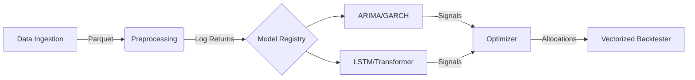

# FinSeries-Opt: Quantitative Research & Optimization Platform


**FinSeries-Opt** is a modular quantitative finance framework designed to bridge the gap between **Econometrics** (ARIMA/GARCH) and **Deep Learning** (LSTMs/Transformers) for portfolio optimization.

Unlike simple prediction scripts, this project implements a robust **Object-Oriented ETL pipeline**, utilizing **vectorized operations** for low-latency backtesting on the **Johannesburg Stock Exchange (JSE)** and US markets.

---

## 🚀 Project Goals

1. **Mathematical Rigor:** Comparative analysis of statistical vs. neural network models for return forecasting.
2. **Engineering Performance:** Implementation of vectorized backtesting to process 5+ years of tick data in milliseconds.
3. **Portfolio Optimization:** Utilizing `scipy.optimize` to maximize the Sharpe Ratio via Modern Portfolio Theory (MPT).

---

## 🏗 System Architecture

The system follows a modular Pipeline Architecture:



### Key Technical Decisions

* **Storage:** Data is serialized to **Parquet** (Columnar storage) instead of CSV, improving I/O read times by ~10x.
* **Stationarity:** All data is transformed to Log-Returns to satisfy the assumptions of weak stationarity required by statistical models.
* **API Handling:** Explicit handling of `yfinance` v0.2+ API changes (enforcing `auto_adjust=False`) to strictly separate Raw Close prices from Adjusted Close prices.

---

## 📉 Mathematical Foundation (Phase 1)

### 1. Logarithmic Returns

To ensure time-additivity and approach normality, we convert raw prices ($P_t$) to log returns ($R_t$):

$$ R_t = \ln\left(\frac{P_t}{P_{t-1}}\right) = \ln(P_t) - \ln(P_{t-1}) $$

### 2. Stationarity Testing (ADF)

We validate the suitability of data for modeling using the **Augmented Dickey-Fuller Test**:

$$ \Delta y_t = \alpha + \beta t + \gamma y_{t-1} + \delta_1 \Delta y_{t-1} + \dots + \delta_{p-1} \Delta y_{t-p+1} + \epsilon_t $$

* **Null Hypothesis ($H_0$):** The series has a unit root (Non-Stationary).
* **Reject $H_0$ (p < 0.05):** The series is Stationary (Ready for Modeling).

---

## 🛠 Installation & Usage

### Prerequisites

* Python 3.10+
* Virtual Environment recommended

### Setup

```bash
# 1. Clone the repository
git clone https://github.com/yourusername/finseries-opt.git
cd finseries-opt

# 2. Create virtual environment
python3 -m venv venv
source venv/bin/activate  # Windows: venv\Scripts\activate

# 3. Install dependencies
pip install -r requirements.txt
```

### Running the Pipeline (Phase 1)

This will fetch JSE Top 40 data, compute returns, and validate stationarity.

```bash
python main.py
```

**Expected Output:**

```text
Fetching data for: ['NPN.JO', 'FSR.JO', 'AGL.JO', 'STX40.JO']
...
--- ADF Test for NPN.JO ---
ADF Statistic: -14.2305
P-Value: 0.0000
Stationary: True
```

---

## 📂 Repository Structure

```text
FinSeries-Opt/
├── data/               # Parquet storage (ignored by Git)
├── notebooks/          # EDA and Prototyping
├── src/
│   ├── __init__.py
│   ├── config.py       # Tickers (JSE/US) and Date ranges
│   ├── loader.py       # ETL: YFinance -> Parquet
│   └── preprocessor.py # Math: Log Returns & ADF Tests
├── main.py             # Entry point
└── requirements.txt
```

---

## 📅 Roadmap

| Phase | Module | Status | Description |
| :--- | :--- | :--- | :--- |
| **1** | **Foundation** | ✅ **Done** | Data ETL, Parquet Caching, Stationarity Checks. |
| **2** | **Econometrics** | 🚧 In Progress | ARIMA/GARCH implementation for baseline volatility modeling. |
| **3** | **Deep Learning** | ⏳ Pending | LSTM & Transformer architecture in PyTorch. |
| **4** | **Optimization** | ⏳ Pending | Mean-Variance Optimization & Efficient Frontier. |
| **5** | **Backtesting** | ⏳ Pending | Event-driven vs Vectorized simulation engine. |

---

## 👤 Author

**Nkosana Molefe**
